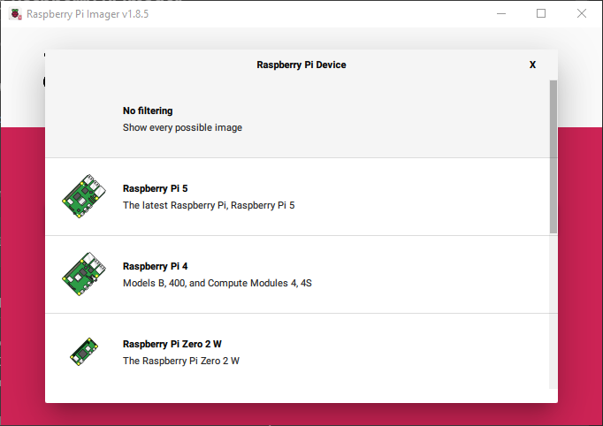

# Installing Ubuntu  on Raspberry Pi 4 

### <ins>Requirements</ins>
- Raspberry Pi  
- Hardware
  - Minimum 4 GB RAM
  - 16 GB storage
- Either an SD card, USB drive, or an external HDD/SSD
  - I started with an SD card but eventually switched to an external SSD
- Secondary computer to flash boot device

## Download Raspberry Pi Imager

To flash the SD card or other boot device with an Ubuntu image, download the Raspberry Pi Imager on the secondary computer.

### For Windows and macOS
Download [Raspberry Pi Imager](https://www.raspberrypi.com/software/) from the Raspberry Pi website


### For Ubuntu or Raspberry Pi
Download from website or run:

```md
sudo apt install rpi-imager
```
## Flash Ubuntu Image on an SD card

- Insert SD card (or USB drive)
- Open the Raspberry Pi Imager after installing

- Select the Raspberry Pi model/device 

- Clink on "Choose OS" and select "Other general-purpose OS"
- Select Ubuntu and the the desired version that best suits your needs.
  - In my case, I selected Ubuntu Desktop 24.04.1 LTS (64-bit)
  - I wanted to explore the Desktop edition a bit so I selected that. You can install Ubuntu server and add a desktop GUI later.

- Click "Choose storage" and select your SD card.
- Click next to start the flashing process.
- The installer will ask if you are sure you want to erase all the data on the SD. Be sure you have the correct SD card selected, and click "YES" to continue.
- Raspberry Pi will verify the process is finished and then you can safely remove you device.

## Boot Ubuntu on Raspberry Pi

- Insert SD card or other device into the Raspberry Pi and power on the Pi.
- Follow through with the Ubuntu installation wizard.
  - Select language
  - Select Keyboard layout
  - Select timezone
  - Create a username and password
  - After the installation is complete you will be prompted to reboot
  - After reboot login with your username and password and go through any welcome prompts.

  ## Update Ubuntu

- Open the terminal and enter update command

```md
sudo apt update && sudo apt upgrade -y
```
